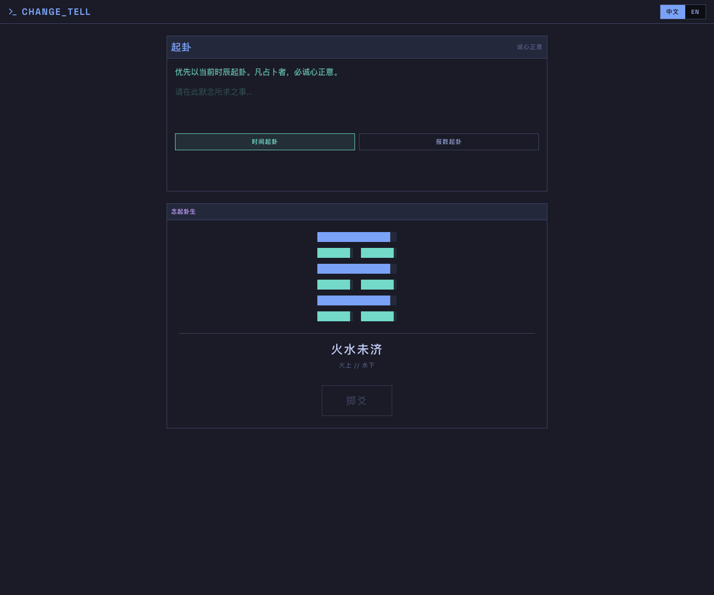
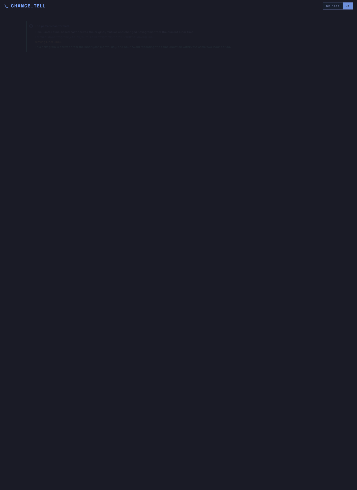
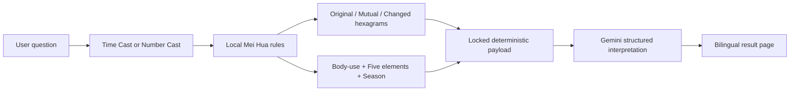
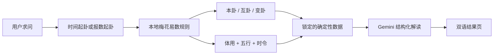

# CHANGE_TELL

Deterministic I Ching casting, bilingual interpretation, and Gemini-powered guidance.

确定性梅花易数起卦、双语解读、Gemini 辅助断语。

[](https://react.dev/)
[](https://www.typescriptlang.org/)
[](https://vite.dev/)
[](https://vercel.com/)
[](https://ai.google.dev/)

[Live Demo](https://changetell.vercel.app) · [English](#english) · [中文](#中文)



## English

CHANGE_TELL is a modern I Ching application built around one principle: the divination rules are deterministic, while AI only writes the interpretation. The app calculates the original hexagram, mutual hexagram, changed hexagram, moving line, body/use trigrams, five-element relation, and seasonal context locally before asking Gemini to produce structured guidance.



### Highlights

- **Deterministic Mei Hua Yi Shu engine**: Time Cast and Number Cast are computed locally.
- **Three-hexagram flow**: Original, mutual, and changed hexagrams are shown as a structured reading path.
- **Body/use judgment**: Moving-line logic identifies body and use trigrams, then evaluates the five-element relation.
- **Seasonal context**: Lunar-month strength is used as secondary context without overriding body/use judgment.
- **Pure bilingual mode**: Chinese and English are both supported; English mode keeps the full UI and interpretation in English.
- **Gemini high-demand fallback**: The API tries `gemini-3.1-flash-lite-preview` first and falls back to `gemini-2.5-flash-lite` only when Gemini reports high demand.

### How It Works



The important boundary is that Gemini does not choose the hexagram or the auspiciousness. It receives fixed data and turns that data into readable analysis and practical advice.

### Quick Start

```bash
npm install
npm run dev
```

Open `http://localhost:3000`.

For local API calls, add a Gemini key:

```bash
GOOGLE_GENERATIVE_AI_API_KEY=your_key_here
```

### Scripts

```bash
npm run dev          # Start Vite
npm run build        # Production build
npm run preview      # Preview the build
npm run lint         # TypeScript check
npm run test:meihua  # Deterministic engine, UI contract, and API contract tests
```

### Deployment

The project is optimized for Vercel.

Required environment variable:

```bash
GOOGLE_GENERATIVE_AI_API_KEY=your_key_here
```

Optional environment variable:

```bash
GEMINI_MODEL=gemini-custom-model
```

When `GEMINI_MODEL` is not set, the server uses this model plan:

1. `gemini-3.1-flash-lite-preview`
2. `gemini-2.5-flash-lite`, only after a recognized Gemini high-demand error

When `GEMINI_MODEL` is set, the server uses only that configured model and fails fast on errors.

### Architecture

```text
src/
  components/        React UI surfaces
  i18n/              zh-CN / en translations and display mappings
  utils/meihua.ts    Deterministic Mei Hua Yi Shu engine
  utils/iching*.ts   Hexagram data and rendering helpers
api/
  chat.ts            Vercel API, Gemini call, model fallback, response shaping
  meihua.ts          Server-side shared casting logic
```

### Design Notes

- The frontend never imports server API modules directly.
- Unsupported saved locales are removed and reset to Chinese.
- English responses are guarded against Chinese-character leakage.
- Result rendering keeps internal Chinese hexagram keys for exact line drawing while displaying localized names.

---

## 中文

CHANGE_TELL 是一个现代周易起卦应用，核心原则是：**起卦和吉凶判断由本地确定性规则完成，AI 只负责结构化表达和建议**。系统会先在本地计算本卦、互卦、变卦、动爻、体用、五行生克和时令旺衰，再把锁定后的数据交给 Gemini 输出可读的解卦内容。

### 核心亮点

- **确定性梅花易数引擎**：支持时间起卦和报数起卦，结果由本地规则计算。
- **三卦流程推演**：本卦看当前，互卦看过程，变卦看趋势。
- **体用生克判断**：根据动爻确定体卦和用卦，再用五行关系输出核心吉凶。
- **时令辅助分析**：结合农历月份判断旺相休囚，但不覆盖体用生克主断。
- **纯双语体验**：支持中文和英语；英语模式下界面、Gemini 综合断语、建议、本卦/互卦/变卦解释都保持英文。
- **Gemini 高负载 fallback**：优先使用 `gemini-3.1-flash-lite-preview`，只有识别到 Gemini 高负载时才切换到 `gemini-2.5-flash-lite`。

### 推演流程



Gemini 不负责随机决定卦象，也不负责改写吉凶。它只能基于已经确定的数据生成解释和建议。

### 本地开发

```bash
npm install
npm run dev
```

打开 `http://localhost:3000`。

如果要本地调用 `/api/chat`，需要配置：

```bash
GOOGLE_GENERATIVE_AI_API_KEY=your_key_here
```

### 常用命令

```bash
npm run dev          # 启动 Vite
npm run build        # 生产构建
npm run preview      # 预览构建结果
npm run lint         # TypeScript 检查
npm run test:meihua  # 起卦规则、UI 契约、API 契约测试
```

### Vercel 部署

必填环境变量：

```bash
GOOGLE_GENERATIVE_AI_API_KEY=your_key_here
```

可选环境变量：

```bash
GEMINI_MODEL=gemini-custom-model
```

未设置 `GEMINI_MODEL` 时，服务端模型策略是：

1. 优先调用 `gemini-3.1-flash-lite-preview`
2. 只有遇到 Gemini 高负载错误时，才 fallback 到 `gemini-2.5-flash-lite`

设置 `GEMINI_MODEL` 后，服务端只使用这个显式模型；如果失败就直接报错，不做隐式 fallback。

### 项目结构

```text
src/
  components/        React 页面组件
  i18n/              zh-CN / en 翻译和显示映射
  utils/meihua.ts    确定性梅花易数引擎
  utils/iching*.ts   六十四卦数据和渲染工具
api/
  chat.ts            Vercel API、Gemini 调用、模型 fallback、响应整形
  meihua.ts          服务端共享起卦逻辑
```

### 设计约束

- 前端运行时代码不直接导入服务端 API 模块。
- 刷新后记住语言；旧的非法语言缓存会被清理并回到中文。
- 英文模式会检测并阻止中文字符泄漏到 AI 返回内容中。
- 卦象绘制使用内部中文卦名作为稳定 key，展示层再做中英文映射。

---

## Roadmap

- Improve visual density on mobile result pages.
- Add shareable read-only result links.
- Add stricter API observability for model fallback events.
- Expand deterministic contract tests for edge-case casts.
